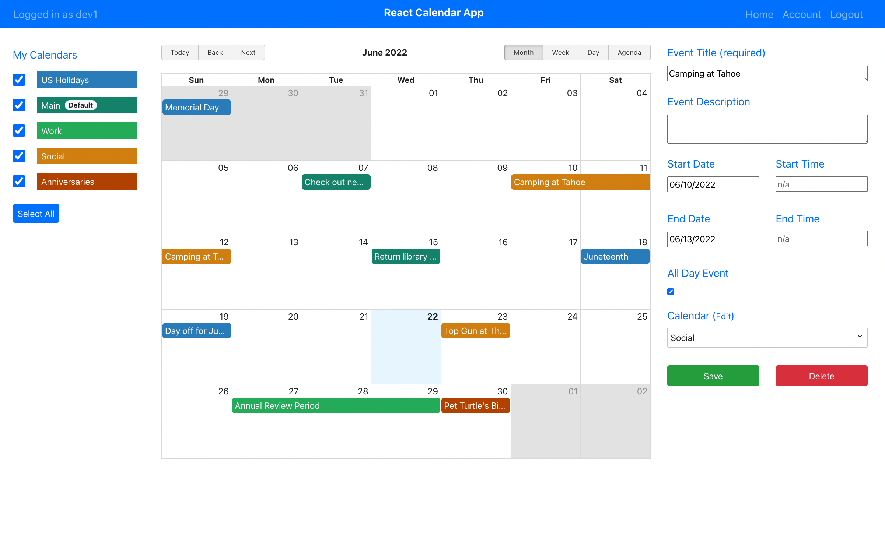

# React Calendar



## Description

**React Calendar** is an easy-to-use online calendar build with [React Big Calendar](https://jquense.github.io/react-big-calendar/examples/index.html?path=/story/about-big-calendar--page). I built this demo as an proof-of-concept to show how to integrate a third party UI library in React. It also utilizes data available at the [Calendarific Holidays API](https://calendarific.com/api-documentation). The app has some architectural elements in place (e.g. JSON Web Token, Mongoose) to help developers scale it up easily. Feel free to fork or extend the codebase for your own project!

React Calendar is an example of a "MERN stack" application which consists of the following technologies:

-   **MongoDB**: A document-based open source database.
-   **Express**: A web application framework for Node.js.
-   **React**: A JavaScript front-end library for building user interfaces.
-   **Node.js**: JavaScript run-time environment that executes JavaScript code outside of a browser (such as a server).

The MERN stack makes it possible to quickly build and easily maintain a full-stack web app. While MERN is a solid foundation for building a web app, extending the app's functionality can sometimes present challenges. For example, while attempting to build an authentication layer using JSON Web Token (JWT), it took me a bit of trial and error to figure out the logic behind the network calls used to create tokens and refresh tokens. Although it wasn't totally clear at first, going through the process step by step helped me better understand not only how to work with JWT, but how the authentication layer impacts the developer and user experience.

## File structure

-   `src`
    -   `config` - This folder holds app configuration files
    -   `client` - This folder holds frontend files
        -   `assets` - This folder holds assets such as images
        -   `components` - This folder holds different components that will make up our views
        -   `pages` - This folder holds components organized by page level view
        -   `store` - This folder holds files used to connect to the Redux store and call actions
        -   `styles` - This folder holds stylesheets used by the frontend
        -   `utils` - This folder holds utility functions
        -   `App.js` - Renders all of our browser routes and different views
        -   `index.html` - Our index.html file
        -   `index.css` - Stylesheet for app-wide styles
        -   `index.js` - Entrypoint for React app
        -   `validation.js` - Used for form validation
    -   `server` - This folder holds backend files
        -   `controllers` - This folder holds controller functions used by Express.js
        -   `db` - This folder holds database connection files
        -   `middleware` - This folder holds middleware used by Express.js
        -   `models` - This folder holds database models
        -   `routers` - This folder holds routers used by Express.js
        -   `utils` - This folder holds utility functions
        -   `server-dev.js` - Entrypoint for Node.js app in development mode
        -   `server-prod.js` - Entrypoint for Node.js app in production mode
-   `package.json` - Defines npm behaviors and packages
-   `package-lock.json` - Tracks dependency tree
-   `.babelrc` - Configuration file for Babel.js
-   `.env.example` - Sample file containing environment variables used by dotenv.js
-   `.gitignore` - Directories to exclude from git tracking
-   `.prettierrc` - Configuration file for Prettier.js
-   `.jest.config.js` - Configuration file for Jest.js
-   `.seedHolidayEvents.js` - Script for seeding holiday event documents in MongoDB
-   `.webpack.common.js` - Webpack configuration file for common settings
-   `.webpack.development.js` - Webpack configuration file for development mode settings
-   `.webpack.production.js` - Webpack configuration file for production mode settings
-   `README.md` - This file!

## Initial Setup

React Calendar was built using Node version 16. Please install a long-term support (LTS) version for best compatibility with other libraries.

-   Node.js <https://nodejs.org/en/download/>

To verify that you have Node.js installed on your system, type the following command in your command line terminal (Terminal for Mac/Linux, CMD for Windows).

```console
node -v
```

### Environment Variables

Before you build or run the app, create two new files called `.env.development` and `.env.production` at the project root. These are configuration files that will be used by dotenv.js to expose environment variables to your app at runtime.

In each file, you need to enter values for the following environment variables (refer to `.env.example` for examples):

`PORT`: Port where the app will run

`MONGO_HOSTNAME`: Name of the Mongo host (e.g. `localhost` in development mode)

`MONGO_PORT`: Mongo port (e.g. `27017`)

`MONGO_DB`: Name of the Mongo database used

`API_URL`: Base URL for API calls to the Node app (e.g. `http://localhost:3001/api` in development mode)

`CALENDARIFIC_KEY`: Base URL for the Calendarific API. You need to create a free Calendarific account in order to generate this key.

`JWT_SECRET_KEY`: Private key used by JSON Web Token (JWT)

`JWT_EXPIRATION`: JWT token expiration (in seconds)

`JWT_REFRESH_EXPIRATION`: JWT refresh token expiration (in seconds)

### MongoDB

React Calendar is designed to work best with a local installation of MongoDB (v4.4.6), but can be used with MongoDB instances located elsewhere.

First set up your local installation of Mongo using instructions corresponding to your operating system.

-   MongoDB <https://www.mongodb.com/try/download>

Once those steps have been completed, and your MongoDB instance is up and running (typically using the terminal command `mongod`), you need to create a new database to store your React Calendar data. This can be done in several ways, but most commonly with the Mongo shell CLI which comes pre-installed with MongoDB. You can start the Mongo shell from your terminal using the `mongo` command. Once you are in the shell, create a new Mongo database (e.g. `reactcalendar_db`).

Next you need to initialize your database with default documents. Luckily this happens automatically on app start via the `connection.js` script, which saves default role and calendar documents in MongodDB.

-   To begin this process, first install React Calendar dependencies using `npm install`. Once that is complete, start the app in development mode with `npm run dev`.

NOTE: Make sure you've created a `.env.development` file at the project root with the required environment variables before running this command! See _Environment Variables_ above.

Once the workflow is complete, the following messages will appear in the terminal:

```text
  Successfully connected to MongoDB
  added "user" to roles collection
  added "moderator" to roles collection
  added "admin" to roles collection
  added "US Holidays" to calendars collection
```

Verify the newly created documents in the `roles` and `calendars` collections by inspecting your database instance using the Mongo shell CLI or another database management tool (e.g. Robot 3T).

Next you need to seed your database with default calendar events using the script `seedHolidayEvents.js`.

-   Open a new terminal window and run the command `node seedHolidayEvents.js`.

This script produces calendar events corresponding to US Holidays data retrieved from the Calendarific API and assigns them to the `US Holidays` system calendar in MongoDB.

NOTE: System calendars contain events that are visible to all users.

Once the workflow is complete, the following messages will appear in the terminal:

```text
  Connected correctly to server
  Database seeded!
```

Verify the newly created documents in the `events` collection of your database. Then try reloading the page at `http://localhost:8080` in your browser to see the updated calendar events.

## Run the app

To run the app in **development mode**, run the command `npm run dev`. This triggers a webpack workflow which lints the source code, applies formatting changes based on Prettier.js configs, builds the `server.cjs` file, and serves up the frontend files in-memory via Webpack Dev Server. Once the workflow is complete, you should be able to see the server running in the terminal. If it started correctly, the following message will appear in the terminal, `Server started at http://localhost:3001`. Then try visiting `http://localhost:8080` in your browser to verify that you can access the frontend.

NOTE: Hot module reloading is turned on by default in development mode. To turn HMR off, remove `hot: true` from the `client` config in `webpack.development.js`.

To run the app in **production mode**, first run the command `npm run build`.

NOTE: Make sure you've created a `.env.production` file with the required environment variables before running this command!

This triggers a webpack workflow which bundles the source code and static assets using Webpack and emits them into the `build` folder. Once you've verified the bundled files have been created, run `npm run pm2` to start the app as a background process using the process management tool PM2. You can use any process manager of your choice, but PM2 generally works well with Node apps.

## Authentication

React Calendar uses JSON Web Token (JWT) for authentication. JWT is a popular choice for authentication in Node.js apps for several reasons:

-   Fewer database queries
-   Less development time
-   Easier to scale up with userbase
-   Better portability across services

Since the backend of the app acts as both issuer and verifier of JWT tokens, it only needs one private key for authentication purposes. This is the key designated in your `.env` files as the `JWT_SECRET_KEY` environment variable.

IMPORTANT: Never share sensitive information such as keys or passwords! Make sure to apply appropriate security settings to prevent exposing your files.

### Authorization

Each user document in the database includes a `roles` field which can take on one of three values: `user`, `moderator` or `admin`. These values aren't currently used for authorization purposes, but can be used to build out an authorization layer on top of the authentication workflow if desired.

## React & Redux

The frontend is a single-page React app that supports client-side routing via React-Router. This enables fast navigation between views and reduces the amount of network calls initiated by the frontend.

NOTE: To support single-page apps in production, you will need to update the configuration of the web server used to serve your app externally (e.g Nginx).

Client data is stored using Redux which promotes data consistency, reduces database calls, and allows the use of Redux Devtools for development.

All updates to Redux data are also persisted to localStorage (in the object located at `localStorage.state`) for access between browser sessions. If at any point the app displays data which appears out of sync, try clearing out your browser's localStorage and reloading the browser window.
